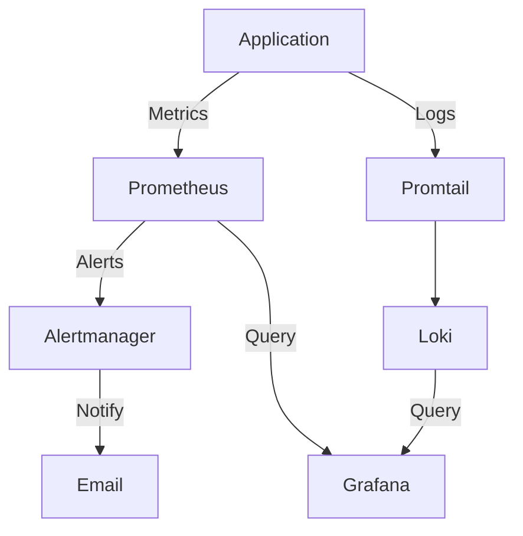

# Exercice Phase 2 : Conception de l'architecture

## Exercice à réaliser

Concevez l'architecture complète de votre solution d'observabilité avec tous les composants et leurs interactions.

## Correction complète - Schéma d'architecture

### Schéma à créer (utilisez draw.io, Lucidchart, ou Mermaid)

```
┌─────────────────────────────────────────────────────────────┐
│                    APPLICATION LAYER                         │
│  ┌──────────────┐  ┌──────────────┐  ┌──────────────┐     │
│  │   App 1      │  │   App 2      │  │   App 3      │     │
│  │  (Flask)     │  │  (Node.js)   │  │  (Python)    │     │
│  │  Port 5000   │  │  Port 3000   │  │  Port 8000   │     │
│  └──────┬───────┘  └──────┬───────┘  └──────┬───────┘     │
│         │                 │                  │              │
│         └─────────────────┴──────────────────┘              │
│                    │                                         │
│                    ▼                                         │
│         ┌──────────────────────┐                            │
│         │   Prometheus         │                            │
│         │   (Scraping)         │                            │
│         │   Port 9090          │                            │
│         └──────────┬───────────┘                            │
└────────────────────┼─────────────────────────────────────────┘
                     │
                     ▼
┌─────────────────────────────────────────────────────────────┐
│              OBSERVABILITY LAYER                            │
│                                                              │
│  ┌──────────────┐      ┌──────────────┐                    │
│  │  Prometheus  │─────▶│ Alertmanager │                    │
│  │  (Storage)   │      │  (Routing)    │                    │
│  └──────┬───────┘      └──────┬───────┘                    │
│         │                      │                            │
│         │                      ▼                            │
│         │              ┌──────────────┐                    │
│         │              │ Notifications│                    │
│         │              │ (Email/Webhook)                   │
│         │              └──────────────┘                    │
│         │                                                    │
│         ▼                                                    │
│  ┌──────────────┐      ┌──────────────┐                    │
│  │   Grafana    │◀─────│    Loki      │                    │
│  │ (Dashboards) │      │  (Logs)      │                    │
│  │  Port 3000   │      │  Port 3100   │                    │
│  └──────────────┘      └──────┬───────┘                    │
│                                │                            │
│                                ▼                            │
│                        ┌──────────────┐                    │
│                        │  Promtail    │                    │
│                        │ (Log Agent) │                    │
│                        └──────────────┘                    │
└─────────────────────────────────────────────────────────────┘
                     │
                     ▼
┌─────────────────────────────────────────────────────────────┐
│              INFRASTRUCTURE LAYER                            │
│                                                              │
│  ┌──────────────┐      ┌──────────────┐                    │
│  │  Terraform   │─────▶│   Ansible    │                    │
│  │(Provisioning)│      │(Configuration)                    │
│  └──────────────┘      └──────────────┘                    │
│                                                              │
│  ┌──────────────┐      ┌──────────────┐                    │
│  │   Docker     │      │   VMs/Cloud  │                    │
│  │ (Containers) │      │ (Infrastructure)                  │
│  └──────────────┘      └──────────────┘                    │
└─────────────────────────────────────────────────────────────┘
```

## Description des flux de données

### Flux 1 : Collecte de métriques

```
Application → Expose /metrics → Prometheus scrape → Stockage time-series
```

**Détails :**
1. L'application expose des métriques sur `/metrics`
2. Prometheus scrape périodiquement (toutes les 15s)
3. Les métriques sont stockées dans la base time-series
4. PromQL permet d'interroger les métriques

### Flux 2 : Ingestion de logs

```
Application → stdout/stderr → Promtail collecte → Loki ingère → Indexation par labels
```

**Détails :**
1. L'application écrit des logs vers stdout/stderr
2. Promtail collecte les logs depuis les fichiers ou Docker
3. Loki ingère les logs avec leurs labels
4. Les logs sont indexés par labels (pas par contenu)

### Flux 3 : Visualisation

```
Prometheus → Grafana (datasource) → Dashboards → Visualisation
Loki → Grafana (datasource) → Log panels → Recherche de logs
```

**Détails :**
1. Grafana se connecte à Prometheus comme datasource
2. Grafana se connecte à Loki comme datasource
3. Les dashboards interrogent les datasources
4. Les utilisateurs visualisent les données

### Flux 4 : Alertes

```
Prometheus → Évalue les règles → Alertmanager → Routage → Notifications
```

**Détails :**
1. Prometheus évalue les règles d'alerte
2. Si condition remplie, alerte envoyée à Alertmanager
3. Alertmanager route selon la configuration
4. Notification envoyée (email, webhook, Slack)

## Intégration Terraform et Ansible

### Workflow d'automatisation

```
1. Terraform provisionne l'infrastructure
   └─> Crée les serveurs/VMs
   └─> Configure les réseaux
   └─> Configure la sécurité

2. Ansible configure les serveurs
   └─> Installe Docker
   └─> Déploie les conteneurs
   └─> Configure les services

3. Application déployée et supervisée
   └─> Prometheus collecte
   └─> Loki ingère
   └─> Grafana visualise
```

## Cas pratique : Supervision d'une application microservices

### Architecture de l'application

```
┌─────────────┐     ┌─────────────┐     ┌─────────────┐
│   Frontend  │────▶│   API       │────▶│  Database   │
│  (React)    │     │  (FastAPI)  │     │ (PostgreSQL) │
└─────────────┘     └─────────────┘     └─────────────┘
```

### Métriques à collecter

**Par service :**
- Latence des requêtes (p50, p95, p99)
- Taux de requêtes (req/s)
- Taux d'erreur (%)
- Utilisation CPU/Mémoire

**Globales :**
- Temps de réponse end-to-end
- Disponibilité des services
- Débit global

### Logs à ingérer

- Logs d'accès (toutes les requêtes)
- Logs d'erreur (erreurs applicatives)
- Logs de performance (requêtes lentes)
- Logs de sécurité (tentatives d'accès)

### Dashboards à créer

1. **Dashboard Système** : CPU, mémoire, disque, réseau
2. **Dashboard Application** : Latence, erreurs, débit par service
3. **Dashboard Business** : Requêtes par endpoint, utilisateurs actifs

### Alertes à configurer

- Service down (disponibilité < 99%)
- Latence élevée (p95 > 1s)
- Taux d'erreur élevé (> 5%)
- Utilisation CPU élevée (> 80%)

## Livrable de la phase

Créez les documents suivants :

1. **Schéma d'architecture global** (format image ou diagramme)
   - Tous les composants
   - Connexions entre composants
   - Ports et protocoles

2. **Schéma de déploiement** (format image ou diagramme)
   - Infrastructure provisionnée
   - Conteneurs et services
   - Réseaux et volumes

3. **Diagramme de flux de données** (format image ou diagramme)
   - Flux de métriques
   - Flux de logs
   - Flux d'alertes

4. **Description textuelle** (document)
   - Explication de l'architecture
   - Justification des choix
   - Description du cas pratique

## Outils recommandés

- **draw.io** : Gratuit, en ligne, exporte en PNG/PDF
- **Lucidchart** : Professionnel, templates
- **Mermaid** : Code-based, intégré dans Markdown
- **PlantUML** : Code-based, très puissant

## Exemple Mermaid (pour documentation)



## Vérification

Vérifiez que vos schémas montrent clairement :
- Tous les composants nécessaires
- Les interactions entre composants
- Les flux de données
- L'intégration Terraform/Ansible

## Prochaine phase

Une fois l'architecture conçue, passez à la **Phase 3 : Provisionnement avec Terraform**.

