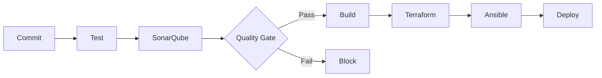

# Exercice Phase 2 : Conception de l'architecture CI/CD

## Exercice à réaliser

Concevez l'architecture complète de votre pipeline CI/CD avec tous les composants et leurs interactions.

## Correction complète - Schéma d'architecture du pipeline

### Pipeline CI/CD complet

```
┌─────────────────────────────────────────────────────────────┐
│                    DEVELOPER WORKFLOW                        │
│                                                              │
│  Developer → Git Commit → Push to GitLab                    │
└────────────────────────────┬────────────────────────────────┘
                             │
                             ▼
┌─────────────────────────────────────────────────────────────┐
│                    GITLAB CI PIPELINE                        │
│                                                              │
│  Stage 1: TEST                                              │
│  ┌────────────────────────────────────────┐                │
│  │  Job: test                             │                │
│  │  - Run unit tests                      │                │
│  │  - Generate coverage report            │                │
│  └────────────────────────────────────────┘                │
│                             │                                │
│                             ▼                                │
│  Stage 2: QUALITY                                           │
│  ┌────────────────────────────────────────┐                │
│  │  Job: sonarqube                        │                │
│  │  - Scan code                           │                │
│  │  - Check Quality Gate                  │                │
│  └──────┬─────────────────────────────────┘                │
│         │                                                    │
│         ▼                                                    │
│  ┌────────────────────────────────────────┐                │
│  │  Quality Gate Check                     │                │
│  │  - Pass → Continue                      │                │
│  │  - Fail → Block pipeline                │                │
│  └──────┬─────────────────────────────────┘                │
│         │                                                    │
│         ▼                                                    │
│  Stage 3: BUILD                                             │
│  ┌────────────────────────────────────────┐                │
│  │  Job: build                             │                │
│  │  - Build Docker image                  │                │
│  │  - Push to registry                   │                │
│  └──────┬─────────────────────────────────┘                │
│         │                                                    │
│         ▼                                                    │
│  Stage 4: DEPLOY                                            │
│  ┌────────────────────────────────────────┐                │
│  │  Job: terraform                        │                │
│  │  - Provision infrastructure           │                │
│  └──────┬─────────────────────────────────┘                │
│         │                                                    │
│         ▼                                                    │
│  ┌────────────────────────────────────────┐                │
│  │  Job: ansible                          │                │
│  │  - Configure servers                  │                │
│  │  - Deploy application                │                │
│  └──────┬─────────────────────────────────┘                │
└─────────┼────────────────────────────────────────────────────┘
          │
          ▼
┌─────────────────────────────────────────────────────────────┐
│                    DEPLOYED APPLICATION                      │
│                                                              │
│  ┌──────────────┐      ┌──────────────┐                    │
│  │  Dev Env     │      │  Prod Env    │                    │
│  │  (Auto)      │      │  (Manual)    │                    │
│  └──────────────┘      └──────────────┘                    │
└─────────────────────────────────────────────────────────────┘
```

## Diagramme de séquence

```
Developer    GitLab CI    SonarQube    Terraform    Ansible    Infrastructure
    │            │            │            │           │            │
    │──commit───▶│            │            │           │            │
    │            │            │            │           │            │
    │            │──test─────▶│            │           │            │
    │            │◀─report────│            │           │            │
    │            │            │            │           │            │
    │            │──scan─────▶│            │           │            │
    │            │◀─quality───│            │           │            │
    │            │            │            │           │            │
    │            │──build─────▶            │           │            │
    │            │            │            │           │            │
    │            │──────────────provision──▶│           │            │
    │            │            │            │           │            │
    │            │────────────────────────────configure─▶│            │
    │            │            │            │           │            │
    │            │            │            │           │──deploy───▶│
    │            │            │            │           │            │
    │            │            │            │           │◀──ready───│
    │            │            │            │           │            │
    │◀──success──│            │            │           │            │
```

## Architecture d'environnement

### Environnements multiples

```
┌─────────────────────────────────────────────────────────────┐
│                    GIT BRANCHES                              │
│                                                              │
│  feature/* → Develop → Main                                 │
└──────┬──────────────┬──────────────┬─────────────────────────┘
       │              │              │
       ▼              ▼              ▼
┌──────────────┐ ┌──────────────┐ ┌──────────────┐
│  Dev Env     │ │ Staging Env  │ │  Prod Env    │
│              │ │              │ │              │
│  Auto Deploy │ │ Auto Deploy  │ │ Manual Deploy│
│  (Terraform) │ │ (Terraform)  │ │ (Terraform)  │
│  (Ansible)   │ │ (Ansible)    │ │ (Ansible)    │
└──────────────┘ └──────────────┘ └──────────────┘
```

## Description des interactions

### Interaction GitLab CI ↔ SonarQube

1. **GitLab CI déclenche SonarQube**
   - Job `sonarqube` dans le pipeline
   - Sonar-scanner analyse le code
   - Résultats envoyés à SonarQube

2. **SonarQube analyse et retourne**
   - Analyse statique du code
   - Détection de bugs, vulnérabilités, code smells
   - Quality Gate évalué

3. **GitLab CI vérifie le Quality Gate**
   - Si Quality Gate passe → Pipeline continue
   - Si Quality Gate échoue → Pipeline bloqué

### Interaction GitLab CI ↔ Terraform

1. **GitLab CI exécute Terraform**
   - Job `terraform` dans le pipeline
   - Terraform init, plan, apply
   - Infrastructure provisionnée

2. **Terraform retourne les outputs**
   - IPs des serveurs
   - IDs des ressources
   - Variables pour Ansible

### Interaction GitLab CI ↔ Ansible

1. **GitLab CI exécute Ansible**
   - Job `ansible` dans le pipeline
   - Playbook Ansible exécuté
   - Configuration et déploiement

2. **Ansible utilise les outputs Terraform**
   - Récupère les IPs depuis Terraform
   - Configure les serveurs
   - Déploie l'application

## Gestion des secrets

### Architecture de sécurité

```
┌─────────────────────────────────────────────────────────────┐
│                    SECRETS MANAGEMENT                        │
│                                                              │
│  ┌──────────────┐      ┌──────────────┐                    │
│  │ GitLab       │      │ Ansible      │                    │
│  │ Variables    │      │ Vault        │                    │
│  │ (Protected)  │      │ (Encrypted)  │                    │
│  └──────┬───────┘      └──────┬───────┘                    │
│         │                      │                            │
│         └──────────┬────────────┘                            │
│                    ▼                                         │
│         ┌──────────────────────┐                            │
│         │   Pipeline Jobs      │                            │
│         │   (Secure Access)    │                            │
│         └──────────────────────┘                            │
└─────────────────────────────────────────────────────────────┘
```

## Livrable de la phase

Créez les documents suivants :

1. **Schéma d'architecture du pipeline** (format image)
   - Toutes les étapes du pipeline
   - Interactions entre GitLab CI, SonarQube, Terraform, Ansible
   - Points de décision (quality gates)

2. **Diagramme de séquence** (format image)
   - Flux d'exécution du pipeline
   - Interactions temporelles
   - Notifications et retours

3. **Architecture d'environnement** (format image)
   - Environnements (dev, staging, prod)
   - Mapping branches → environnements
   - Promotion entre environnements

4. **Description textuelle** (document)
   - Explication de chaque interaction
   - Justification des choix
   - Gestion des secrets

## Exemple Mermaid - Pipeline



## Vérification

Vérifiez que vos schémas montrent clairement :
- Toutes les étapes du pipeline
- Les interactions entre outils
- Les points de décision
- La gestion des secrets
- Les environnements multiples

## Prochaine phase

Une fois l'architecture conçue, passez à la **Phase 3 : Mise en place du pipeline GitLab CI**.

